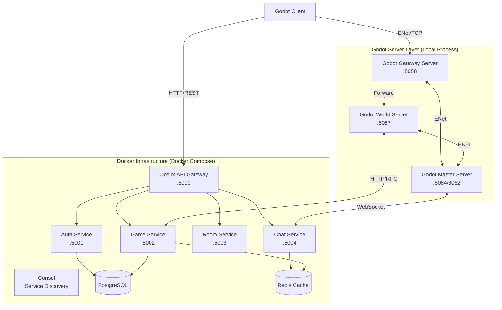

# Tiny MMO Backend Architecture

这是一个基于微服务架构的多人在线游戏后端系统，采用 **Dockerized .NET Microservices** + **Local Headless Godot Servers** 的混合架构设计。

## 🏗️ 整体架构概览

本系统将游戏后端分为两大部分：
1.  **基础设施与业务微服务**：运行在 Docker 容器中，负责账号、数据持久化、聊天、房间管理等通用业务。
2.  **游戏逻辑服务器**：运行为 Godot Headless 实例（通常在本地开发环境直接运行），负责物理模拟、实时战斗计算和场景同步。

### 架构图



---

## 🧩 核心组件详解

### 1. 基础设施层 (Docker)

| 服务名称 | 端口 | 描述 |
| :--- | :--- | :--- |
| **Consul** | `8500` | 服务注册与发现中心，所有 .NET 微服务启动时自动注册。 |
| **PostgreSQL** | `5432` | 核心数据库，存储用户账号、角色数据、聊天记录等。 |
| **Redis** | `6379` | 高速缓存，用于 Session 管理、聊天消息队列、实时状态缓存。 |

### 2. 微服务层 (.NET 8 / Docker)

所有微服务通过 Ocelot API Gateway 统一暴露，内部通过 Consul 发现。

*   **API Gateway (`:5000`)**
    *   统一入口，处理路由、鉴权、限流。
    *   将外部 HTTP 请求转发至内部微服务。
*   **Auth Service (`:5001`)**
    *   用户注册、登录、JWT Token 签发。
    *   管理用户 Session。
*   **Game Service (`:5002`)**
    *   处理角色创建、物品清单、游戏配置数据。
    *   与 Godot World Server 交互，持久化玩家数据。
*   **Room Service (`:5003`)**
    *   管理副本/房间实例的生命周期。
    *   处理匹配逻辑。
*   **Chat Service (`:5004`)**
    *   基于 SignalR/WebSocket 的实时聊天服务。
    *   支持世界频道、私聊、系统广播。

### 3. 游戏服务器层 (Godot Headless)

这些服务通常在开发时作为本地进程运行，以便快速调试 GDScript。

*   **Master Server**
    *   **端口**: `8064` (Gateway Manager), `8062` (World Manager)
    *   **职责**: 协调中心。管理所有 Gateway 和 World 节点的注册与状态。
    *   **依赖**: 连接到 Chat Service。
*   **Gateway Server**
    *   **端口**: `8088` (Client Connection)
    *   **职责**: 负载均衡器。玩家首先连接到此服务器，验证 Token 后被转发至合适的 World Server。
    *   **依赖**: 连接到 Master Server。
*   **World Server**
    *   **端口**: `8087` (Game World)
    *   **职责**: 承载实际游戏地图。处理移动、战斗、物理碰撞等核心逻辑。
    *   **依赖**: 连接到 Master Server, Game Service, Chat Service。

---

## 🚀 开发环境启动指南

### 第一步：启动后端基础设施

在 `GameBackend` 目录下运行：

```powershell
docker-compose up -d
```

等待所有容器启动并变为 Healthy 状态。你可以通过 `docker ps` 查看状态。

### 第二步：启动 Godot 服务器实例

你需要打开 3 个终端窗口（或在 Godot 编辑器中运行 3 个实例），按顺序启动：

1.  **启动 Master Server**
    ```powershell
    # 在项目根目录
    godot --headless source/server/master/master_main.tscn
    ```
2.  **启动 Gateway Server**
    ```powershell
    godot --headless source/server/gateway/gateway_main.tscn
    ```
3.  **启动 World Server**
    ```powershell
    godot --headless source/server/world/world_main.tscn
    ```

### 第三步：启动客户端

运行 Godot 客户端连接本地环境：

```powershell
godot source/client/client_main.tscn
```

---

## ⚙️ 关键配置说明

### 配置文件位置
*   Godot 配置: `data/config/*.cfg`
*   Docker 配置: `GameBackend/docker-compose.yml`

### 端口映射表

| 服务 | 宿主机端口 | 容器/内部端口 | 说明 |
| :--- | :--- | :--- | :--- |
| **API Gateway** | 5000 | 8080 | HTTP API 入口 |
| **Auth Service** | 5001 | 8080 | 认证服务 |
| **Game Service** | 5002 | 8080 | 游戏数据服务 |
| **Room Service** | 5003 | 8080 | 房间服务 |
| **Chat Service** | 5004 | 8080 | 聊天服务 |
| **Godot Gateway**| 8088 | 8088 | 游戏客户端连接端口 |
| **Godot World** | 8087 | 8087 | 游戏逻辑端口 |
